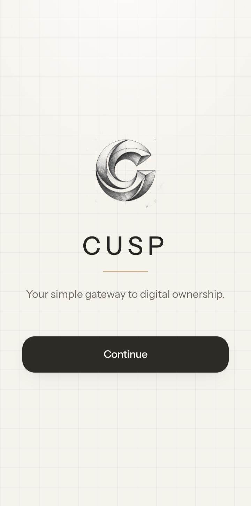
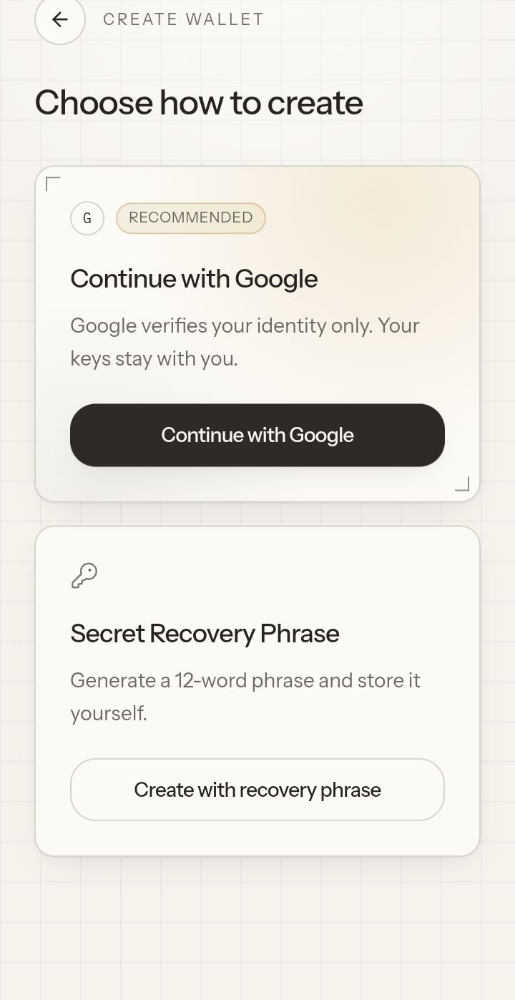
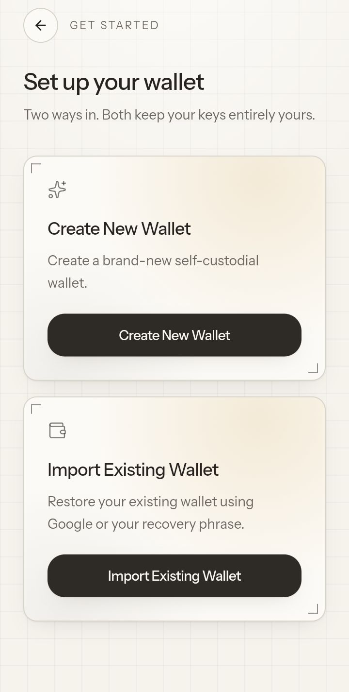
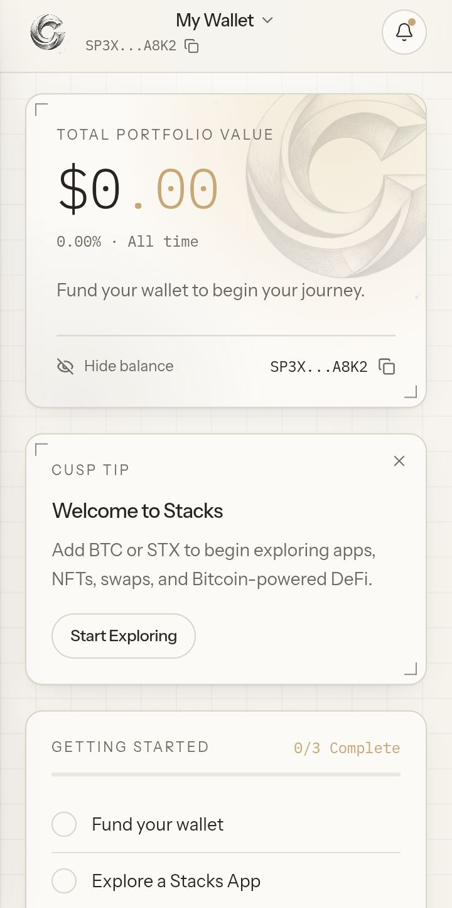
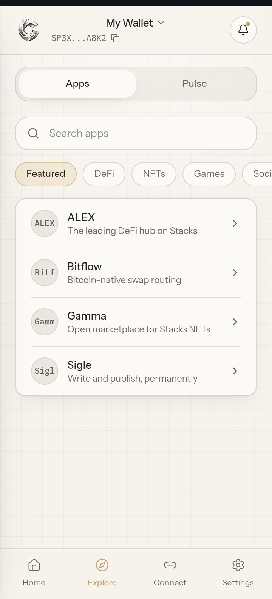
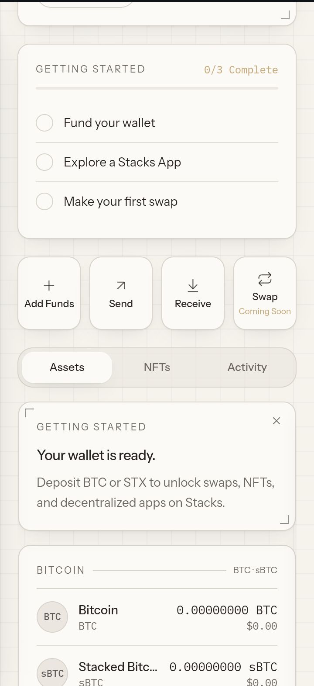

# Cusp

**A next-generation self-custodial Bitcoin & Stacks wallet designed to make Web3 onboarding simple, secure, and intuitive.**

Cusp bridges familiar Web2 experiences with true Web3 ownership by combining a beginner-friendly onboarding experience with the transparency and control of a self-custodial wallet.

> **Current Status:** High-fidelity interactive prototype for usability testing and investor demonstrations.

---

# Vision

Digital ownership should be as simple as signing into your favorite app—without sacrificing privacy, security, or control.

Cusp reimagines the first experience of using a crypto wallet by reducing friction while preserving the principles of self-custody. Our goal is to make Bitcoin and the Stacks ecosystem accessible to everyone, from first-time users to experienced Web3 participants.

---

# The Problem

Today's crypto wallets often assume users already understand seed phrases, networks, gas fees, wallet connections, and blockchain terminology. This creates unnecessary friction and discourages adoption.

Many newcomers abandon the onboarding process because it feels intimidating, while experienced users still expect powerful wallet functionality without compromising security.

---

# The Solution

Cusp provides a modern onboarding experience inspired by consumer applications while maintaining true self-custody.

### Key Principles

- Beginner-friendly onboarding
- Google-assisted identity verification (without compromising ownership)
- Bitcoin-first architecture through the Stacks ecosystem
- Premium, intuitive interface
- Transparent security and permission management
- Progressive education throughout the wallet experience

---

# Key Features

- Self-custodial wallet
- Bitcoin & Stacks ecosystem support
- Google-assisted onboarding
- Recovery phrase support
- Portfolio dashboard
- Send & Receive assets
- Stacks ecosystem swaps (planned)
- Curated dApp discovery
- Secure dApp connection manager
- Bitcoin & Stacks ecosystem news (Pulse)
- Network switching (Mainnet, Testnet & Signet)
- Security Center & Recovery Center

  
## Screenshots

### Splash Screen

### Onboarding 1

### Onboarding 2

### Wallet Interface 1

### Explore

### Wallet Interface 2

---

# Design Philosophy

Cusp avoids the visual clichés commonly found in crypto applications.

Its interface combines the clarity of premium financial products with subtle inspiration from architectural sketches and precision engineering.

The result is a calm, trustworthy, and distinctive user experience designed to reduce anxiety while building confidence in digital ownership.

---

# Technology Stack

- React
- TypeScript
- Vite
- Tailwind CSS
- shadcn/ui
- Lovable
- Vercel

---

# Prototype Status

This repository currently contains a **high-fidelity interactive prototype**.

The application intentionally simulates wallet interactions and does **not** yet implement:

- Blockchain integration
- Wallet generation
- Transaction signing
- Google OAuth
- Live balances
- Smart contracts
- Backend services
- Live market data

The focus of this stage is validating product design, user experience, and onboarding before engineering the production implementation.

---

# Roadmap

## Phase 1 — Interactive Prototype

- Complete onboarding flows
- Dashboard refinement
- Explore and Pulse
- Connect dApps
- Security flows
- Accessibility improvements

## Phase 2 — Backend Foundation

- Google authentication
- Wallet creation
- Encrypted key management
- Backend services
- User sessions

## Phase 3 — Blockchain Integration

- Stacks wallet integration
- Transaction signing
- Portfolio synchronization
- Live balances
- Real swaps
- dApp connectivity

## Phase 4 — Production Release

- Security audits
- Testing
- Performance optimization
- Public beta
- Mainnet launch

---

# Repository Structure

This repository contains the interactive prototype for Cusp and serves as the foundation for future development into a fully functional Bitcoin and Stacks wallet.

---
 ## Documentation

- [Security Model](SECURITY.md)
- [Product Overview](PRODUCT.md)
- [Architecture](ARCHITECTURE.md)
- [Development Roadmap](ROADMAP.md)
- [Changelog](CHANGELOG.md)

# Contributing

Contributions, ideas, and constructive feedback are welcome as Cusp evolves from prototype to production.

---

# License

This project is currently under active development.

No open-source license has been assigned at this stage.

